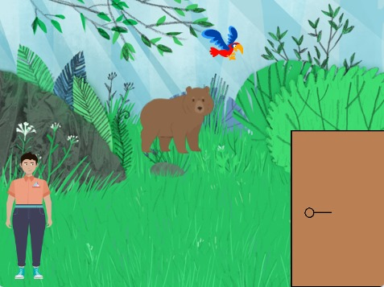

# Escape the Forest - A Scratch Game

An interactive Scratch game where players navigate a dense forest, solve puzzles, and make decisions to escape safely while collecting hidden treasures.

## 🎮 Features
- Explore the forest and uncover hidden secrets.
- Solve puzzles to progress through the story.
- Make decisions that affect the game's outcome.

## 🚀 How to Play
1. Download the `.sb3` file from this repository.
2. Open the file in the [Scratch editor](https://scratch.mit.edu/).
3. Use the arrow keys to move and interact with objects.
4. Solve puzzles and find the way out of the forest!

## 📷 Screenshots

## 📂 File Structure
- `Escape the Forest.sb3` - Main project file.
- `gameplay.png` - Game screenshot.

## 🛠️ How It Works
This project was created using [Scratch](https://scratch.mit.edu/), a visual programming language for creating interactive projects.

## 📜 License
This project is licensed under the MIT License. See the `LICENSE` file for details.

## 🙌 Acknowledgments
- Thanks to the Scratch community for inspiration.
- Created by Mahmoud Salah.
